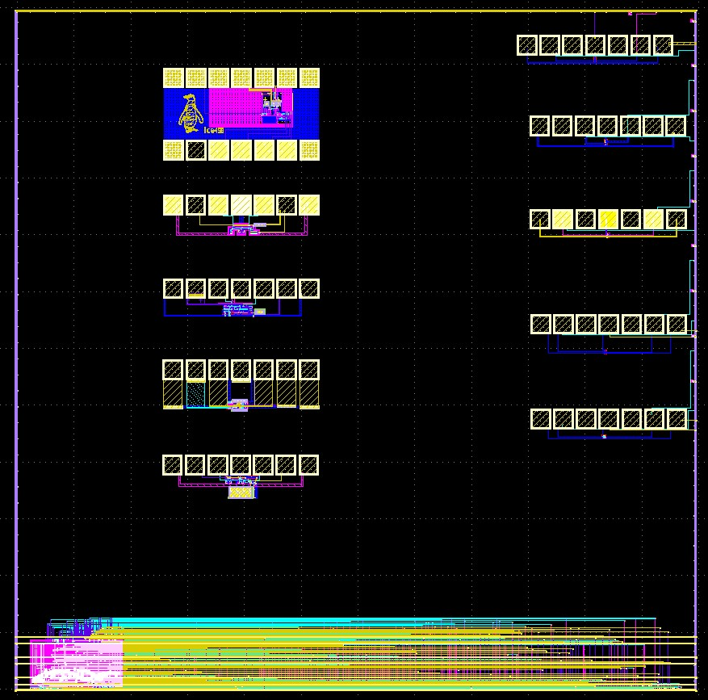

#  ISHI-KAI Multiple Users Project
We, [ISHI-KAI](https://ishi-kai.org/), are a community that promotes open source PDK & EDA.  
This time, we brought together eight novice semiconductor designers (most of whom were new to semiconductor design), each of whom created an analog circuit, such as an Inverter or OPAmp made using xschem & klayout with P-Cells .  
It will then be a group application that combines them into one layout.  

- 
- 

## How do you run an analog circuit on the OpenMPW GF-1?
Since ISHI-KAI has university professors and semiconductor companies as collaborators, we are able to borrow probers through the generosity of professors and companies.  
Therefore, we plan to prepare a pad on silicon and run analog circuits by probing.  

- 
- 

# Members (9 Members)
- [3zki](https://github.com/3zki)
- ajisai
- [bols-blue](https://github.com/bols-blue)
- [gitefu](https://github.com/Gitefu)
- [homelith](https://github.com/homelith)
- [ice458](https://github.com/ice458)
- [noritsuna](https://github.com/noritsuna)
- [ponzu840w](https://github.com/mulwak)
- [yamada3](https://github.com/keropiyo)

# Members' Designs (10 Designs)
## [3zki](member_project/3zki/)
I designed a rail-to-rail opamp.

I am assuming Vdd=5.0V and Vb=2.5V.

- 
- 

## [ajisai](member_project/ajisai/)
I designed my first semiconductor and built an inverter circuit.  

- 
- 

## [bols-blue](member_project/bols-blue/)
I designed my first semiconductor and built an inverter circuit.  

- 
- 

## [gitefu](member_project/Gitefu/)
I am a graduate school student majoring in processor research, and I am involved in robot building with a group called [tofunology](https://tofunology.github.io/site/).

One day, through an event, I learned about the organization [ISHI-KAI](https://ishi-kai.org/) and decided to participate in a project where each member creates an analog circuit to be integrated onto a single chip.

However, I had little knowledge of analog circuits. 
This was my first time making an operational amplifier, and being a beginner, I faced many challenges. However, with a lot of support from [ISHI-KAI](https://ishi-kai.org/)  members, I was able to complete it.

Through this project, I've gained a solid understanding of the fundamentals of analog circuits and the process of creating chips. I feel extremely pleased with the experience

### About My Circuit
This is the operational amplifier on a chip I made for the first time.This operational amplifier was created with reference to following website.  
Akira Tsuchiya「GF180でオペアンプ設計してみよう」[https://note.com/akira_tsuchiya/n/n710ed2d0e428](https://note.com/akira_tsuchiya/n/n710ed2d0e428) (Published:2023/09/19 23:24)

### Contact
X : [@tnk_make](https://twitter.com/tnk_make)

### TestBench
[op_tb.sch](member_project/gitefu/op_tb.sch)  
- 
- 

### Last Layout
[op_20231204.gds](member_project/gitefu/op_20231204.gds)  

### Flatten Layout
[op_20231204_flat.gds](member_project/gitefu/op_20231204_flat.gds)  
- 

## [homelith](member_project/homelith/)
This is the first time I designed my semiconductor, building a simple inverter circuit.

Although my PMOS design is relatively smaller than expected by counterpart NMOS, I dare submit on current composition for measure real performance of un-balanced design.

This attempt tells me a important understanding of principles of semiconductor design and I would like to express my gratitude to this project.

- 
- 

## [ice458](member_project/ice458/)
I designed a dynamic comparator.

### [xschem](member_project/ice458/dynamic_comparator/xschem/)
At first I was designing a 4-bit asynchronous SAR ADC, but in the middle of the project, I realized that I could not use 3.3V transistors and that I did not have time for layout, so I decided to make only a comparator.

- 

### [klayout](member_project/ice458/dynamic_comparator/klayout/)
This is the layout of the comparator.

- 

## [noritsuna](member_project/noritsuna/)
I designed my first semiconductor and built an inverter&opamp circuit.  

### [inverter/xschem](member_project/noritsuna/inverter/xschem/)
Here you will find the schematic for the inverter and the test bench for PEX.  
- 
- 

### [inverter/klayout](member_project/noritsuna/inverter/klayout/)
Here is the layout for the inverter.  
- 

### [opamp/xschem](member_project/noritsuna/opamp/xschem/)
Here you will find the schematic for the opamp and the test bench for PEX.  

- 
- 

### [opamp/klayout](member_project/noritsuna/opamp/klayout/)
Here is the layout for the opamp.  
- 

## [ponzu840w](member_project/ponzu840w/)
I am an electronics undergraduate student working on analog circuit design.  
In this shuttle I designed a simple inverter. This work has helped me to understand the IC design flow with open source CAD tools.  

- 
- 

## [yamada3](member_project/yamada3/)
I was able to build an operational amplifier for the first time!
Thanks to the "mokumoku-kai" of ISHI-KAI, which was held every day until midnight, I was able to do it with everyone's help. Thank you very much.
I am glad that I did not give up and worked on it.

- 
- 

 
